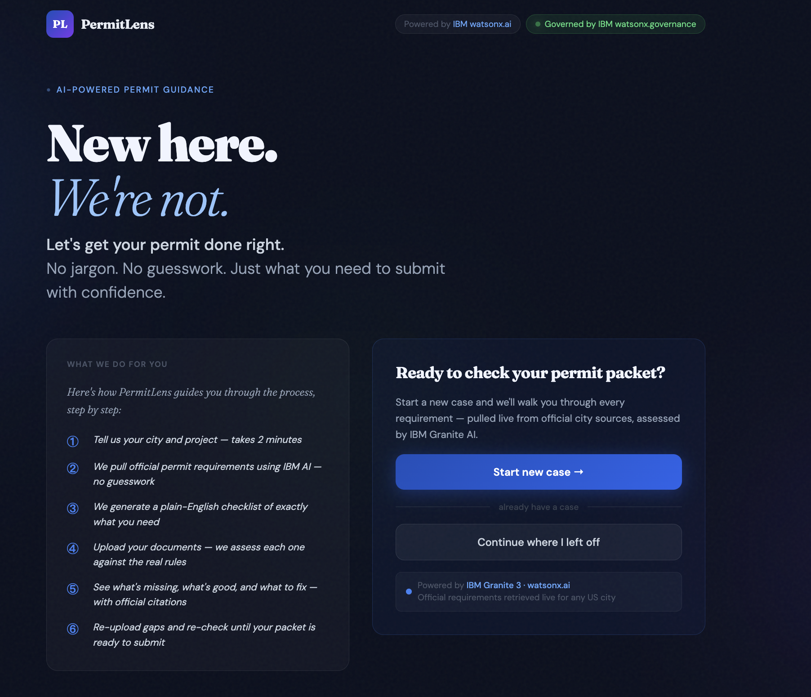
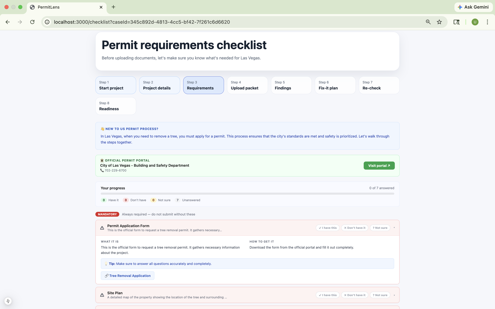
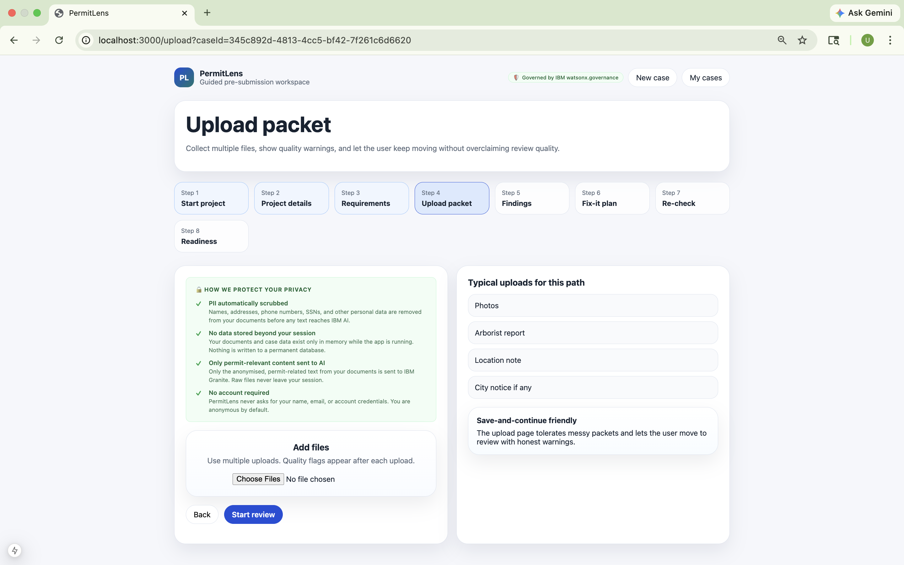
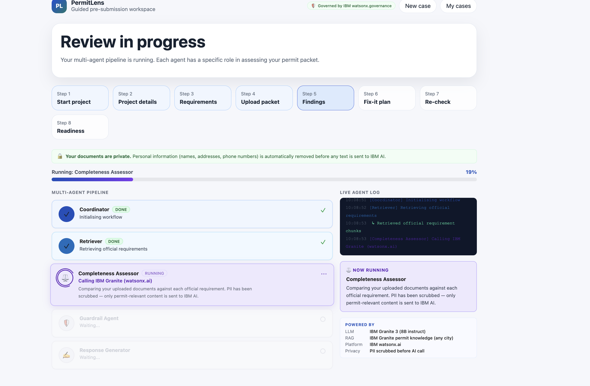
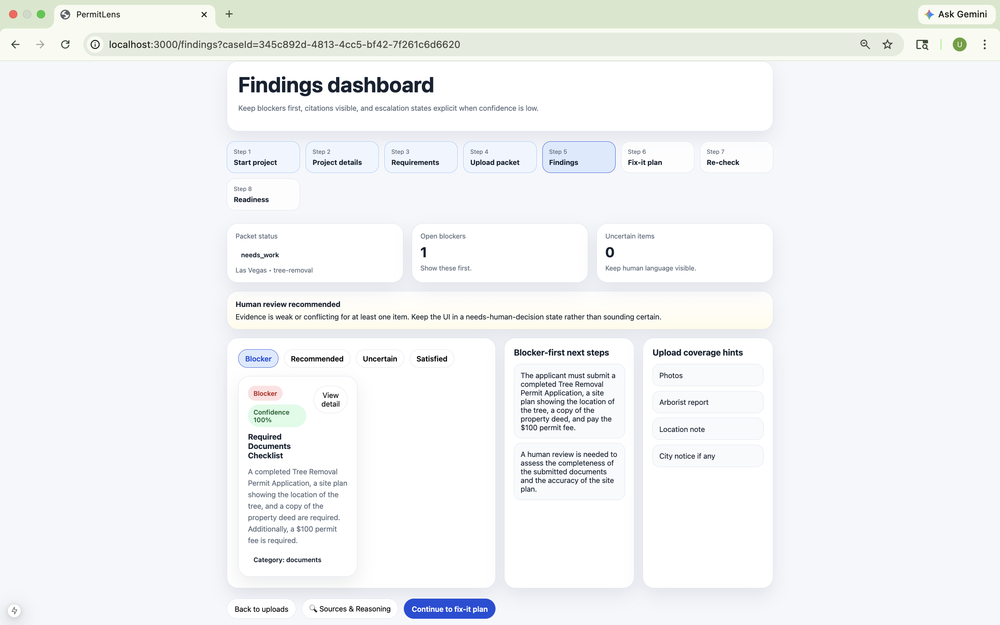
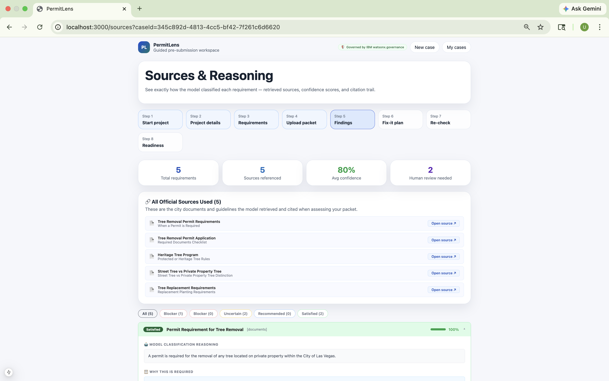
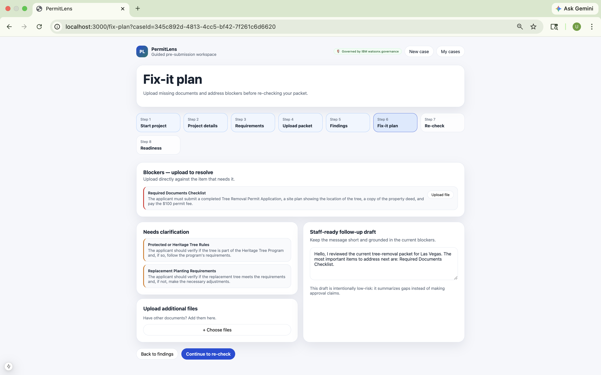
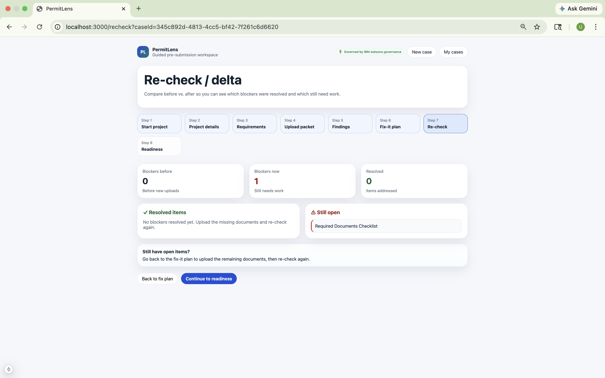

# PermitLens

## Disclaimer: This repo is top-level project description of our proprietary solution. if you are interested in collaboration send a message to https://www.linkedin.com/in/tripathiutkarsh46/ or https://www.linkedin.com/in/preethisighavi/ 

## How to Contribute
You can contribute in either of these ways:

1. **Fork-based contribution**
   - Fork the repository (if enabled)
   - Create a feature branch
   - Make your changes
   - Submit a pull request

2. **Request collaborator access**
   - Contact me if you want to contribute directly in the main private repository

## Recognition
All contributors will be recognized through:
- commit history
- pull request authorship
- a Contributors section in the README
- release notes for significant contributions


**New here. We're not. Let's get your permit done right.**

PermitLens is an AI-powered permit packet pre-submission assistant built for IBM watsonx. Whether you are a longtime homeowner or someone new to the US navigating city permits for the first time, PermitLens walks you through every requirement — pulling live official rules, generating a plain-English checklist, assessing your documents, and showing you exactly what is missing before you submit.

Built on a **multi-agent RAG pipeline** powered by **IBM Granite 3 (watsonx.ai)** and governed by **IBM watsonx.governance**.

---

## Screenshots

### Landing Page


---

### Requirements Checklist


---

### Upload Packet


---

### Multi-Agent Pipeline (Processing)


---

### Findings Dashboard


---

### Sources & Reasoning


---

### Fix-it Plan


---

### Re-check Delta


---

## The problem it solves

Permit applications get rejected because applicants do not know what to submit. City permit pages are dense, inconsistent, and written for professionals. First-time applicants — especially people new to the US — have no way to know what documents they need, what format they need to be in, or what will cause an instant rejection.

PermitLens fixes this before submission, not after.

---

## What it does

| Step | What happens |
|---|---|
| **Landing page** | Introduces PermitLens. Start new case or continue an existing one. |
| **Case intake** | User enters city, project type, property type, and plain-language description. |
| **Project details** | Adaptive intake form tailored to the project type (tree removal, deck, fence, solar, ADU, etc.). |
| **Requirements checklist** | IBM Granite generates a city-specific checklist — Mandatory / Often Required / Check with City — with official links, how-to-get guidance, and newcomer tips. User marks what they have, don't have, or are unsure about. |
| **Upload packet** | User uploads permit documents (PDFs, images, Word docs). PII scrubbed before AI processing. Quality flags shown per file. |
| **Multi-agent processing** | Animated pipeline shows all 5 AI agents running in real time with a live log feed. |
| **Findings dashboard** | AI findings categorised as Blocker / Recommended / Uncertain / Satisfied with confidence scores. |
| **Sources & Reasoning** | Full explainability — model reasoning, why each requirement exists, confidence bars, official source URLs with snippets, and which files matched. |
| **Fix-it plan** | Per-blocker upload buttons. Upload missing documents directly against the requirement that needs them. Staff-ready follow-up draft auto-generated. |
| **Re-check / delta** | Re-runs assessment after new uploads. Shows before/after blocker count and which items resolved vs still open. |
| **Submission readiness** | Honest final state — never claims approval, shows packet strength and what still needs human review. |

---

## Architecture — Multi-agent RAG pipeline

```
User request
    │
    ▼
Coordinator Agent
    │
    ├── Retriever Agent
    │       Calls IBM Granite to generate official permit requirements
    │       for any US city — no seed files or database needed
    │
    ├── Completeness Assessor Agent
    │       Calls IBM Granite to classify each requirement:
    │       satisfied | missing_blocker | recommended | uncertain | needs_human_decision
    │       Uses user's checklist responses as additional context
    │
    ├── Guardrail / Critic Agent
    │       Enforces scope limits, source grounding, confidence thresholds
    │       Removes approval claims. Flags risks to watsonx.governance.
    │
    └── Response Generator Agent
            Builds plain-language explanations, blocker-first next steps, packet status
```

**IBM services:**

| Service | Role |
|---|---|
| **IBM watsonx.ai — Granite 3 8B Instruct** | All LLM calls: checklist generation, requirement retrieval, assessment, response generation |
| **IBM watsonx.governance** | Inference logging, risk flagging, scope violation detection, AI Factsheets |

---

## Privacy & PII protection

PermitLens was built with privacy as a constraint, not an afterthought:

| Protection | How it works |
|---|---|
| **PII scrubbing** | Names, addresses, phone numbers, SSNs, driver's license numbers, and credit card numbers are automatically removed from all uploaded documents before any text is sent to IBM AI |
| **No permanent storage** | Case data lives only in memory during the session — nothing is written to a database |
| **No account required** | Users are anonymous by default — no name or email is ever collected |
| **Only permit content sent to AI** | Only the anonymised, permit-relevant text is sent to IBM Granite — raw files never leave the local session |
| **Guardrail enforcement** | Every AI finding is checked for scope violations — we never claim permit approval or legal compliance |
| **Source citation required** | Every finding must cite an official city document or it is downgraded to uncertain |

---

## Tech stack

| Layer | Technology |
|---|---|
| Frontend | Next.js 15, React 19 |
| Backend | Node.js 20, Express |
| AI model | IBM Granite 3 8B Instruct via watsonx.ai REST API |
| RAG retrieval | IBM Granite knowledge-based — works for any US city |
| Checklist generation | IBM Granite — city-specific, with official links and newcomer tips |
| Governance | IBM watsonx.governance — inference monitoring, risk flagging, AI Factsheets |
| PII protection | Custom regex scrubber in parsingService — runs before every AI call |

---

## Project structure

```
PermitLens/
├── README.md
├── .gitignore
├── docs/screenshots/          ← Add your screenshots here
│
├── permitlens-frontend/
│   ├── app/
│   │   ├── page.js                  Landing page
│   │   ├── start/page.js            Step 1: intake
│   │   ├── project-details/page.js  Step 2: adaptive form
│   │   ├── checklist/page.js        Step 3: AI checklist
│   │   ├── upload/page.js           Step 4: file uploads + privacy badge
│   │   ├── processing/page.js       Step 5: live agent pipeline
│   │   ├── findings/page.js         Step 6: findings dashboard
│   │   ├── sources/page.js          Step 7: sources & reasoning
│   │   ├── fix-plan/page.js         Step 8: fix-it plan
│   │   ├── recheck/page.js          Step 9: re-check delta
│   │   ├── readiness/page.js        Step 10: submission readiness
│   │   └── cases/page.js            My cases
│   ├── components/
│   │   ├── AppShell.js              Page wrapper — logo links to landing, governance badge
│   │   ├── Stepper.js               Step progress bar
│   │   ├── PrivacyBadge.js          Reusable privacy trust component (card/inline/minimal)
│   │   ├── RequirementCard.js       Single finding card
│   │   ├── RequirementDrawer.js     Slide-in finding detail
│   │   ├── CitationCard.js          Source citation with URL
│   │   ├── StatusBadge.js           Blocker/Satisfied/Uncertain pill
│   │   ├── ConfidenceBadge.js       Confidence level indicator
│   │   ├── EscalationBanner.js      Human review warning
│   │   └── NextStepsPanel.js        Blocker-first action list
│   ├── hooks/                       useCase, useFindings, useUploads, useRecheck
│   ├── lib/                         api.js, constants, utils, mock-engine
│   ├── backend-setup.sh
│   ├── frontend-setup.sh
│   └── .env.local
│
└── permitlens-backend/
    ├── src/
    │   ├── agents/                  coordinator, retriever, completenessAssessor, guardrail, responseGenerator
    │   ├── adapters/
    │   │   ├── watsonxAiAdapter.js       LLM calls via IAM token + REST API
    │   │   ├── watsonxDataAdapter.js     Granite knowledge-based retrieval (any city)
    │   │   └── watsonxGovernanceAdapter.js  AI Factsheets + inference event logging
    │   ├── routes/                  cases, uploads, assessment, findings, checklist
    │   └── services/
    │       ├── parsingService.js    File → text + PII scrubbing
    │       ├── checklistService.js  AI checklist generation + response storage
    │       └── ...others
    ├── knowledge-base/seed/         Fallback JSON chunks for local dev
    ├── uploads/                     Runtime file storage (gitignored)
    ├── .env.example
    └── package.json
```

---

## Prerequisites

```bash
# Node.js 20+
brew install node@20
brew link node@20 --force
node --version   # must be v20.x.x
npm --version    # must be 10.x.x

# Backend hot-reload
npm install -g nodemon
```

---

## Setup

### Option A — Automated

```bash
# Backend
cd permitlens-backend
chmod +x backend-setup.sh && ./backend-setup.sh

# Frontend
cd ../permitlens-frontend
chmod +x frontend-setup.sh && ./frontend-setup.sh
```

### Option B — Manual

```bash
# Backend
cd permitlens-backend
npm install
cp .env.example .env
mkdir -p uploads

# Frontend
cd ../permitlens-frontend
npm install --legacy-peer-deps
echo "NEXT_PUBLIC_API_URL=http://localhost:3001" > .env.local
```

---

## Environment variables

### Backend (`permitlens-backend/.env`)

```env
PORT=3001
NODE_ENV=development

# IBM watsonx.ai — Hackathon Sandbox
WATSONX_AI_APIKEY=<get from team lead>
WATSONX_AI_URL=https://us-south.ml.cloud.ibm.com
WATSONX_AI_PROJECT_ID=2dc314bd-3f25-487f-9fbf-49669036f6a6
WATSONX_AI_MODEL_ID=ibm/granite-3-8b-instruct

# Adapter flags — set to local for mock mode (no IBM credentials needed)
AI_ADAPTER=ibm
DATA_ADAPTER=ibm
GOVERNANCE_ADAPTER=local
ORCHESTRATE_ADAPTER=local

UPLOAD_DIR=./uploads
KNOWLEDGE_BASE_DIR=./knowledge-base/seed
```

### Frontend (`permitlens-frontend/.env.local`)

```env
NEXT_PUBLIC_API_URL=http://localhost:3001
# NEXT_PUBLIC_USE_MOCK=true   # uncomment for mock mode
```

> Never commit `.env` or `.env.local` to git. Both are in `.gitignore`.

---

## Running locally

```bash
# Terminal 1 — Backend
cd permitlens-backend && npm run dev

# Terminal 2 — Frontend
cd permitlens-frontend && npm run dev
```

Open **http://localhost:3000**

---

## Verify

```bash
curl http://localhost:3001/health

curl -X POST http://localhost:3001/api/cases \
  -H "Content-Type: application/json" \
  -d '{"city":"San Jose","projectType":"tree_removal","description":"Remove oak tree","intakeForm":{}}'

# Replace <caseId>
curl -X POST http://localhost:3001/api/cases/<caseId>/checklist/generate
curl -X POST http://localhost:3001/api/cases/<caseId>/assess
curl http://localhost:3001/api/cases/<caseId>/assessment-status
curl http://localhost:3001/api/cases/<caseId>/findings
```

---

## API reference

| Method | Path | Description |
|---|---|---|
| GET | `/health` | Service health and adapter status |
| POST | `/api/cases` | Create a new case |
| GET | `/api/cases` | List all cases |
| GET | `/api/cases/:id` | Get single case |
| PATCH | `/api/cases/:id` | Update intake form |
| POST | `/api/cases/:id/uploads` | Upload packet files |
| POST | `/api/cases/:id/checklist/generate` | Generate AI requirements checklist |
| POST | `/api/cases/:id/checklist/save` | Save user checklist responses |
| GET | `/api/cases/:id/checklist` | Get saved checklist |
| POST | `/api/cases/:id/assess` | Start assessment job |
| GET | `/api/cases/:id/assessment-status` | Poll job progress |
| GET | `/api/cases/:id/findings` | Get full findings |
| POST | `/api/cases/:id/recheck` | Re-run after new uploads |
| GET | `/api/cases/:id/delta` | Before/after blocker comparison |

---

## Key design decisions

**Why IBM Granite for retrieval instead of a vector database?**
Granite has been trained on US municipal codes and city ordinances. Using it as the retrieval source means PermitLens works for any US city without maintaining a database. Each call asks Granite to generate structured requirement chunks for the specific city and project type — live, with real official URLs.

**Why a pre-assessment checklist?**
City permit pages are written for professionals. The checklist step gives users — especially newcomers — a plain-English baseline before uploading a single document. User responses also feed into the Assessor as context, making AI classification more accurate.

**Why show model reasoning?**
Permit decisions affect real people's homes. Showing why the model classified something as a blocker — with the exact official source cited — builds trust and lets users verify the AI's work.

**Why scrub PII before the AI call?**
Users upload real documents containing their names, addresses, and signatures. Sending that to any LLM without consent is a privacy violation. The scrubber runs before every AI call so IBM Granite only ever sees permit-relevant content.

**Why never claim approval?**
The Guardrail agent scans every finding for phrases like "permit approved" and "guaranteed compliance" and removes them before they reach the frontend. Final approval always belongs to city staff.

---

## Troubleshooting

| Problem | Fix |
|---|---|
| `node: command not found` | `brew install node@20 && brew link node@20 --force` |
| `npm install` fails with ERESOLVE | `npm install --legacy-peer-deps` |
| Port 3001 in use | `lsof -ti:3001 \| xargs kill` then restart |
| Port 3000 in use | `lsof -ti:3000 \| xargs kill` then restart |
| Findings show placeholder data | Set `AI_ADAPTER=ibm` in `.env` and restart |
| No chunks found for city | Set `DATA_ADAPTER=ibm` in `.env` |
| Assessment over 60 seconds | Normal for IBM Granite cold start — wait it out |
| Cases disappear after restart | In-memory storage — start a new case |
| `Failed to fetch` in browser | Backend not running — check Terminal 1 |
| Checklist shows mock data | Set `AI_ADAPTER=ibm` in `.env` |

---

## License

MIT
